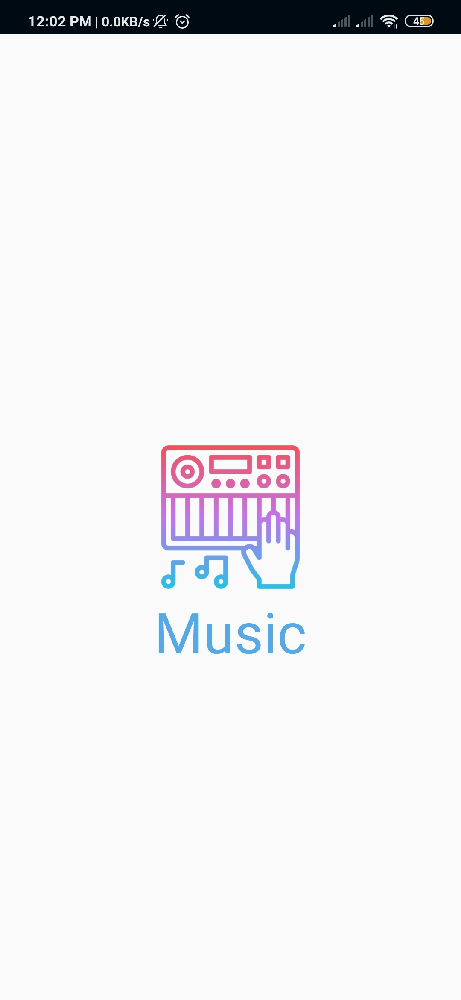

# Musical Structure App
  This project is one of Udacity Android Basics Nanodegree project.

## Using:
* Recycler View
* Handler Class
* Custom Class
* Butter Knife
* Grid View

## Screen shots
  
 
  

## Udacity review

